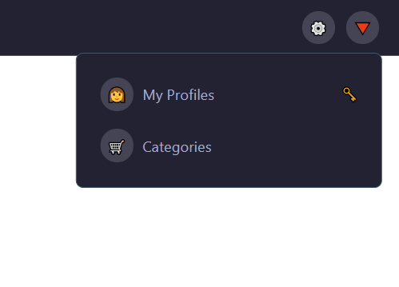
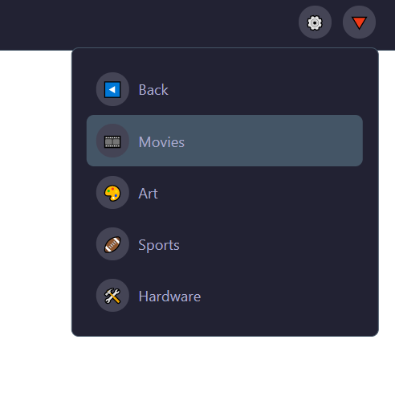

# Dropdown menu react

A simple dropdown menu component in react.

### `npm start`

Runs the app in the development mode. 
Open [http://localhost:3000](http://localhost:3000) to view it in the browser.

### `npm run build`

Builds the app for production to the `build` folder. 
It correctly bundles React in production mode and optimizes the build for the best performance.

### Screenshots:

#

### More information.
This Project is based on a tutorial by fireship.io on [youtube.com](https://www.youtube.com/watch?v=IF6k0uZuypA)